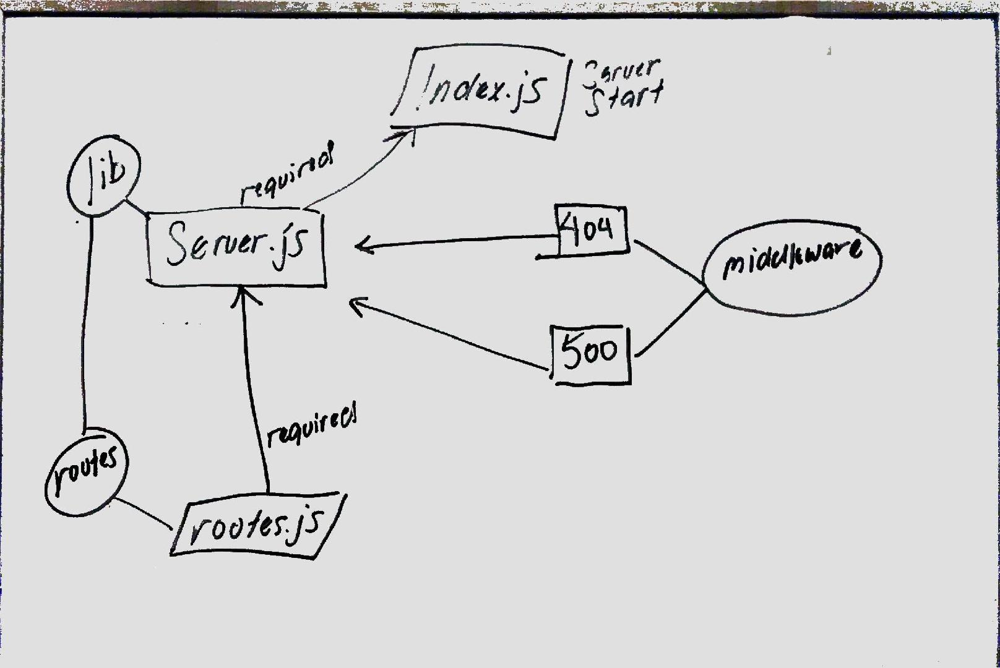

# LAB - 07

## Server API

### Author: Joseph Hangarter

### Links and Resources
* [submission PR](http://xyz.com)
* [travis](http://xyz.com)

### Modules
#### `index.js` - start server `server.js` required in
#### `routes.js` - where routes reside
#### `404.js` - middleware not found error 
#### `500.js` - middleware catch all error
#### `server.js` - `routes.js`, `404.js`, & `500.js` required in
#### `supergoose.js` - combines SuperTest and Mongoose Memory Server

##### Exported Values and Methods
### `notFound` - return not found if route is inexistent
### `errorHandler` - catch all error

### Setup
#### `.env` requirements
* `PORT` - 8080

#### Running the app
* `nodemon index.js`
* `http :8080/categories`
  
#### Tests
* `npm test`

#### UML

